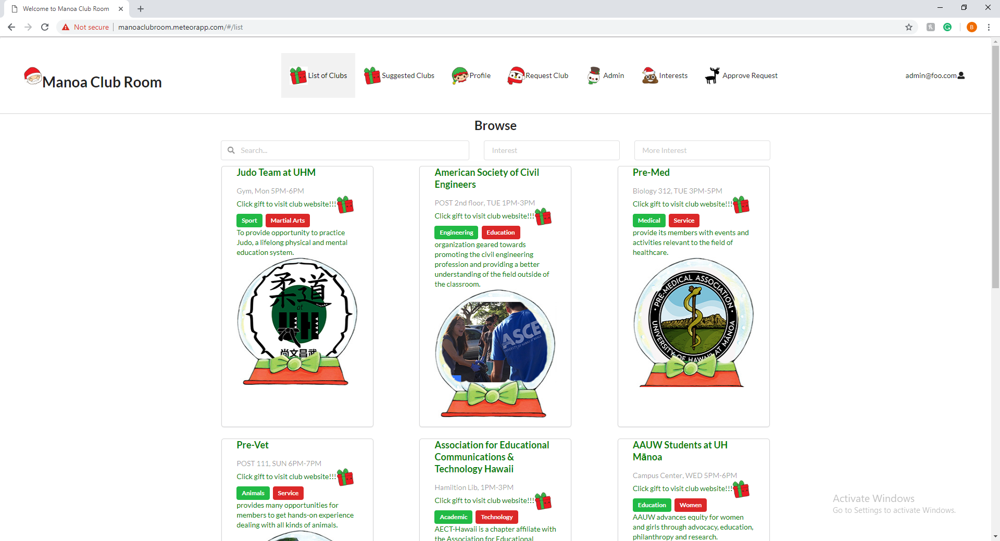

 Here is an example of our List Clubs page:
 

This project was made in my ICS 314, Fall 2018. The program was created in Meteor and deployed through Galaxy. For this project, I was tasked with the admin side of our application. I needed to implement an edit and delete buttons that were fully functional and only admins were allowed to access. I also implemented default data and accounts that we could use to test to see if the functionality of our app was working the way we intended it to. If you would like to see the source code of our project you can head to our GitHub organization page here: https://github.com/manoaclubroom/manoaclubroom  

In this project, I gained a lot of experience with Meteor, and how difficult it can be to work in groups when developing especially if collaborating on different systems (Mac or Windows). Our group had a lot of problems merging our code because of this. This caused a lot of frustration for me especially because for the last week or so of our project, I was unable to merge my code into the master branch. The only way I was able to successfully get my code into the master branch was by asking my team members to copy and paste the code from the branch I made into the master branch. This was a very inefficient way to collaborate and in the future, I need to take action earlier rather than later to make sure that I don't run into any merging issues. Other than the merging issues, however, the project went a lot better than expected. Even though my team members and I were all rather new to meteor we were able to complete our goal of making an easy way to view the different clubs at UH Manoa. There are always things that you can improve on, and this project helped me understand how much more I will need to commit myself in order to become a competent programmer. 
